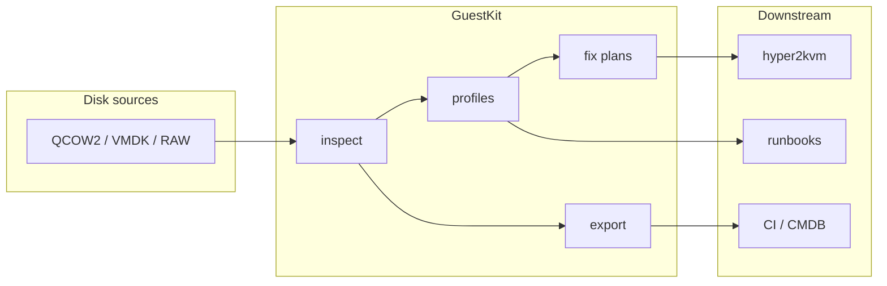

<p align="center">
  <strong>GuestKit</strong><br>
  <sub>Pure-Rust VM disk inspection — no boot required</sub>
</p>

<p align="center">
  <a href="https://github.com/hypersdk/guestkit/actions/workflows/ci.yml"></a>
  <a href="https://crates.io/crates/guestkit"></a>
  <a href="https://pypi.org/project/hypersdk-guestkit/"></a>
  
  <a href="https://www.gnu.org/licenses/lgpl-3.0"></a>
</p>

<p align="center">
  <a href="https://zyvor.dev/demo?utm_source=github&utm_medium=guestkit"><strong>▶ Watch migration demo</strong></a>
  &nbsp;·&nbsp;
  <a href="https://zyvor.dev/contact?utm_source=github&utm_medium=guestkit">Contact sales</a>
  &nbsp;·&nbsp;
  <a href="https://zyvor.dev/?utm_source=github&utm_medium=guestkit">Full platform</a>
</p>

---

**GuestKit** inspects and repairs VM disks **while they are powered off**. Point it at a QCOW2, VMDK, or RAW image and get OS facts, security findings, network layout, packages, services, and exportable reports — in seconds, from a single static binary.

Built in **Rust** for safety and speed. Pairs with **[hyper2kvm](https://github.com/hypersdk/hyper2kvm)** for VMware → KVM migration pipelines. Optional **TUI**, **REPL shell**, **AI diagnostics**, and **Python** bindings when you need more than one-shot CLI output.

## Why GuestKit?

| Without GuestKit | With GuestKit |
|------------------|---------------|
| Boot every VM to “just check” config | Inspect offline images in place |
| Fragile shell scripts over `guestfish` | Structured JSON/YAML/HTML/PDF output |
| No fleet-wide security posture view | Batch inspect + profiles across many disks |
| Migration surprises at first power-on | fstab/crypttab analysis and fix plans before cutover |

```bash
cargo install guestkit    # installs guestkit + guestctl; or: pip install hypersdk-guestkit
guestkit inspect vm.qcow2
guestctl tui vm.qcow2       # guestctl is an alias for guestkit
guestkit inspect vm.qcow2 --profile security
guestctl vm.qcow2           # shorthand → inspect
```

### Aliases

| Name | Role |
|------|------|
| `guestkit` | Primary CLI binary |
| `guestctl` | Same CLI (kubectl-style alias); help, completions, and tips use the name you invoked |

Run `guestctl` with no subcommand for a quick-start banner, or `guestctl commands` for a grouped command list.

## See it in action

```text
┌────────────────────────────────────────────────────────┐
│ Ubuntu 22.04 LTS                                        │
│ linux · x86_64 · hostname: webserver-prod               │
└────────────────────────────────────────────────────────┘

💾 Block devices    /dev/sda  8.0 GiB
🌐 Network          eth0 192.168.1.100/24 (up)
📦 Packages         1,234 (deb)
🔧 Services         45 systemd units
🔐 Security         firewalld active · SSH keys present

→ guestkit inspect vm.qcow2 --profile security   # full risk report
→ guestkit inspect vm.qcow2 --export report.html
```

## Features

| | |
|---|---|
| **Inspect** | OS, hostname, disks, network, packages, DBs, web servers, users, kernel |
| **TUI** | Multi-view dashboard — files, security, services, storage, fuzzy jump (`Ctrl+P`) |
| **Shell** | REPL with `ls`, `cat`, `grep`, `explore`, upload/download, optional `ai` |
| **Profiles** | Security, compliance, hardening, performance, migration readiness |
| **Fix plans** | Preview offline changes → export bash/Ansible → apply with backup/rollback |
| **Batch** | Parallel fleet inspection with caching (`inspect-batch --parallel 8`) |
| **Export** | JSON, YAML, HTML, PDF for tickets and automation |
| **Formats** | QCOW2, VMDK, VDI, VHD/VHDX, RAW, IMG, ISO |
| **Python** | PyO3 bindings — same inspection API in pipelines |
| **AI** *(optional)* | Natural-language triage on top of deterministic facts (`--features ai`) |

## Quick start

### Install

```bash
# Rust (installs guestkit and guestctl)
cargo install guestkit

# Python
pip install hypersdk-guestkit

# From source
git clone https://github.com/hypersdk/guestkit && cd guestkit && cargo build --release

# Docker
docker build -t guestkit:latest .
docker run --privileged -v ./vms:/vms:ro guestkit:latest inspect /vms/vm.qcow2
```

See [Docker guide](docs/guides/DOCKER.md) · [Remote deploy](docs/guides/DEPLOY-REMOTE.md) (`make deploy-remote H=<host> U=root`)

**Client tarball (no deploy scripts):** same bundle from GitHub Releases or a remote Linux build:

```bash
# GitHub: download guestkit-*-linux-amd64.tar.gz from Releases
# Remote build:
./scripts/package-binary-remote.sh HOST USER --fetch
# Customer: tar xzf guestkit-*-linux-amd64.tar.gz && ./install.sh && ./test-host.sh
```

See [docs/PACKAGE_BINARY_REMOTE.md](docs/PACKAGE_BINARY_REMOTE.md).

### Essential commands

| Goal | Command |
|------|---------|
| Inspect | `guestkit inspect disk.qcow2` (or `guestctl disk.qcow2`) |
| JSON for CI | `guestkit inspect disk.qcow2 -o json` |
| TUI | `guestctl tui disk.qcow2` |
| Command list | `guestctl commands` |
| REPL | `guestkit interactive disk.qcow2` |
| Security scan | `guestkit inspect disk.qcow2 --profile security` |
| Fleet | `guestkit inspect-batch ./vms/*.qcow2 --parallel 4 -o json` |
| Diff two images | `guestkit diff before.qcow2 after.qcow2` |
| File browser | `guestkit explore disk.qcow2 /etc` |

## How it fits your stack



**Typical flows**

- **Migration** — inspect → profile migration → fix plan → hand off to [hyper2kvm](https://github.com/hypersdk/hyper2kvm)
- **Incident response** — `tui` or `interactive` on a clone without powering on production
- **Compliance** — `inspect --profile compliance` → HTML/PDF reports for auditors
- **Automation** — `inspect -o json` → jq → your ticketing or inventory system

## Disk formats

| Path | Formats | Mechanism |
|------|---------|-----------|
| Fast | RAW, IMG, ISO | loop device |
| Universal | QCOW2, VMDK, VDI, VHD/VHDX | QEMU NBD |

Repeated runs on the same image? Use `--cache` or convert once: `qemu-img convert -O raw vm.qcow2 vm.raw`.

## Python (30 seconds)

```python
from guestkit import Guestfs

with Guestfs() as g:
    g.add_drive_ro("vm.qcow2")
    g.launch()
    for root in g.inspect_os():
        print(g.inspect_get_distro(root), g.inspect_get_hostname(root))
```

More examples: [`examples/python/`](examples/python/) · [Python guide](docs/user-guides/python-bindings.md)

## AI diagnostics *(optional)*

```bash
cargo build --release --features ai
export OPENAI_API_KEY=sk-...
guestkit interactive vm.qcow2
# ai why won't this boot?
```

AI interprets inspection data you already collected — it does not replace deterministic checks. Sensitive images: keep AI off or use air-gapped workflows.

## Documentation

| Topic | Link |
|-------|------|
| **Full docs index** | [docs/INDEX.md](docs/INDEX.md) |
| CLI reference | [docs/user-guides/cli-guide.md](docs/user-guides/cli-guide.md) |
| TUI | [docs/features/tui-enhancements.md](docs/features/tui-enhancements.md) |
| Interactive shell & explore | [docs/features/explore/EXPLORE-QUICKSTART.md](docs/features/explore/EXPLORE-QUICKSTART.md) |
| Security profiles | [docs/user-guides/profiles.md](docs/user-guides/profiles.md) |
| Fix plans | [docs/features/fix-plans.md](docs/features/fix-plans.md) |
| Export formats | [docs/features/export-formats.md](docs/features/export-formats.md) |
| VM migration | [docs/user-guides/vm-migration.md](docs/user-guides/vm-migration.md) |
| Architecture | [docs/architecture/overview.md](docs/architecture/overview.md) |

## Project layout

```text
guestkit/
├── src/
│   ├── cli/          # commands, TUI, shell, profiles, exporters
│   ├── guestfs/      # disk inspection & file operations
│   ├── disk/         # partition & filesystem primitives
│   └── python.rs     # PyO3 bindings
├── docs/             # guides & reference
├── examples/         # Rust & Python samples
└── scripts/          # deploy-remote.sh, selftest.sh
```

## Roadmap snapshot

- ✅ TUI dashboard, security profiles, JSON/YAML/HTML/PDF export
- ✅ Interactive shell, Python bindings, batch + cache
- 🔄 Richer Windows boot/EFI diagnostics
- 🔄 Deeper offline edit safety gates
- 🔮 Cloud image pull (S3/Azure/GCP) · plugin profiles

Details: [docs/development/roadmap.md](docs/development/roadmap.md)

## Contributing

```bash
git clone https://github.com/hypersdk/guestkit && cd guestkit
cargo test && cargo clippy && cargo fmt
```

Bug reports and PRs welcome on GitHub. See [Contributing](docs/development/CONTRIBUTING.md).

## License

**LGPL-3.0-or-later** — commercial use allowed; modifications to GuestKit itself must stay open under LGPL. See [LICENSE](LICENSE).

---

## Support

<p align="center">
  <a href="https://zyvor.dev/">
    
  </a>
</p>

**GuestKit** is the open-source guest-disk component of the [HyperSDK Platform](https://zyvor.dev/) (Zeus suite), from [Zyvor AI Labs](https://zyvor.dev/).

### GitHub (this repository)

- [Issues](https://github.com/hypersdk/guestkit/issues) — bugs and features
- [Discussions](https://github.com/hypersdk/guestkit/discussions) — questions and ideas
- [docs/](docs/) — full documentation tree

### Enterprise — [zyvor.dev](https://zyvor.dev/)

Production migrations, VMware exit programs, SLAs, and the integrated platform (dashboard, RBAC, fleet orchestration) are provided by **Zyvor**, not via GitHub Issues.

| | |
|---|---|
| **Demo** | [zyvor.dev/demo](https://zyvor.dev/demo?utm_source=github&utm_medium=guestkit) |
| **Sales** | [sales@zyvor.dev](mailto:sales@zyvor.dev) |
| **Contact** | [zyvor.dev/contact](https://zyvor.dev/contact?utm_source=github&utm_medium=guestkit) |

| Product | Focus |
|---------|--------|
| [HyperSDK](https://zyvor.dev/hypersdk) | Multi-cloud export & APIs |
| [hyper2kvm](https://zyvor.dev/hyper2kvm) | Conversion & validation at scale |
| [GuestKit](https://zyvor.dev/guestkit) | Offline inspect, repair, profiles |
| [v9s](https://zyvor.dev/v9s) · [PacketWolf](https://zyvor.dev/packetwolf) | KubeVirt ops · eBPF observability |

📄 [Open source vs Enterprise](docs/ce-vs-enterprise.md) · [Enterprise guide](docs/zyvor-enterprise.md) · [Security](SECURITY.md)

### Related open-source repos

| GitHub | Role |
|--------|------|
| [hypersdk](https://github.com/hypersdk/hypersdk) | Hypervisor SDK |
| [hyper2kvm](https://github.com/hypersdk/hyper2kvm) | VM migration toolkit |
| **guestkit** *(this repo)* | Guest disk inspection |

---

<p align="center">
  <sub>Questions? <a href="https://github.com/hypersdk/guestkit/issues">Open an issue</a> or <a href="https://github.com/hypersdk/guestkit/discussions">start a discussion</a>.</sub>
</p>
