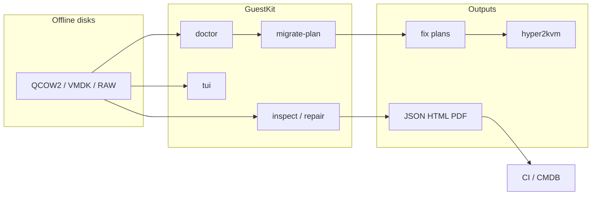

<p align="center">
  <strong>GuestKit</strong><br>
  <sub>Offline VM intelligence & migration assurance — powered on <a href="https://zyvor.dev/guestkit?utm_source=github&utm_medium=guestkit">zyvor.dev</a></sub>
</p>

<p align="center">
  <a href="https://github.com/hypersdk/guestkit/actions/workflows/ci.yml"></a>
  <a href="https://crates.io/crates/guestkit"></a>
  <a href="https://pypi.org/project/hypersdk-guestkit/"></a>
  
  <a href="https://www.gnu.org/licenses/lgpl-3.0"></a>
</p>

<p align="center">
  <a href="https://www.youtube.com/watch?v=ZYCz6HN7bXE"><strong>▶ Watch demo</strong></a>
  &nbsp;·&nbsp;
  <a href="https://zyvor.dev/demo?utm_source=github&utm_medium=guestkit"><strong>zyvor.dev/demo</strong></a>
  &nbsp;·&nbsp;
  <a href="https://zyvor.dev/contact?utm_source=github&utm_medium=guestkit">Contact sales</a>
</p>

<p align="center">
  <a href="https://www.youtube.com/watch?v=ZYCz6HN7bXE">
    
  </a>
</p>

---

**GuestKit** answers the question every migration team asks too late: *will this VM actually boot on the target?*

Inspect **QCOW2, VMDK, or RAW** images **without powering them on**. Score boot probability, generate hypervisor-aware migration plans, export executable fix plans, and explore disks from a carbon-themed TUI — all in **Rust**, with structured JSON/YAML/HTML/PDF for CI.

Part of the open-source stack on **[zyvor.dev](https://zyvor.dev/guestkit?utm_source=github&utm_medium=guestkit)** · pairs with **[hyper2kvm](https://github.com/hypersdk/hyper2kvm)** for VMware → KVM pipelines.

## Three commands before cutover

```bash
cargo install guestkit   # guestkit + guestctl

guestkit doctor vm.qcow2 --target proxmox --explain
# → 82% boot probability · blockers · root-cause chain

guestkit migrate-plan vm.vmdk --target proxmox --export plan.yaml
# → migration score · driver injections · executable fix plan

guestctl tui vm.qcow2
# → carbon TUI · grouped views · offline file browser
```

| Without GuestKit | With GuestKit |
|------------------|---------------|
| Boot every VM to “just check” | Inspect offline in place |
| Shell scripts over `guestfish` | Evidence snapshots + structured export |
| Migration surprises at power-on | **`doctor`** score before cutover |
| Manual runbooks for fleet drift | **`fleet analyze`** · **`forensic-diff`** |

## TUI — control plane in your terminal

`guestctl tui` is a multi-view dashboard for incident response and deep dives — no VM boot required.

| | |
|---|---|
| **Navigation** | Two-tier tabs: **Overview · System · Security** + views in group · `Ctrl+P` jump menu |
| **Keys** | `Tab` cycle views · `{` `}` switch groups · `h` scrollable help · vim `j`/`k` |
| **Views** | Dashboard, issues, packages, services, files, storage, profiles, topology, … |
| **Fleet** | `guestctl tui img.qcow2 --fleet ./images/` — sidebar, **N** / **P** switch disks |
| **Theme** | Carbon graphite + orange accent — config in `~/.config/guestkit/tui.toml` |

→ [TUI guide](docs/features/tui-enhancements.md)

## Features

| | |
|---|---|
| **Doctor** | Bootability `%` on KVM/Proxmox/cloud — blockers, warnings, `--explain` |
| **Migrate-plan** | Target-aware score, drivers, downtime · **`--export`** fix plan YAML/JSON |
| **Inspect** | OS, disks, network, packages, DBs, web servers, users, kernel, security |
| **Windows** | `--profile windows-migration` — BitLocker, VirtIO, hypervisor remnants |
| **Policy** | Expression DSL (`bootability.score >= 80`) · `guestkit policy check` |
| **Fleet** | Cluster identical VMs, snowflakes, migration blockers |
| **Forensic diff** | Security drift between two snapshots |
| **Repair** | `guestkit repair --fix boot` — plan apply + post-check |
| **Fix plans** | Preview → export bash/Ansible → apply with backup/rollback |
| **Shell** | REPL: `ls`, `cat`, `grep`, `explore`, upload/download, optional `ai` |
| **Batch** | `inspect-batch --parallel 8` with cache |
| **SBOM/CVE** | SPDX/CycloneDX + OSV lookup (offline cache) |
| **Cloud** | S3/Azure/GCS sources (`--features cloud-s3`, …) |
| **Python** | PyO3 — same API in pipelines |
| **AI** *(opt)* | Narration on deterministic evidence (`--features ai`) |

**Aliases:** `guestkit` (primary) · `guestctl` (kubectl-style) — same binary, your choice of name.

## Quick start

```bash
# Install
cargo install guestkit
# pip install hypersdk-guestkit

# Assurance workflow
guestkit doctor disk.qcow2 --target kvm -o json
guestkit migrate-plan disk.vmdk --target proxmox --export migration.yaml
guestkit repair disk.qcow2 --fix boot --dry-run

# Inspect & report
guestkit inspect disk.qcow2 --profile security --export report.html
guestkit fleet analyze ./vms/ -o json

# Explore
guestctl tui disk.qcow2
guestkit interactive disk.qcow2
guestkit explore disk.qcow2 /etc
```

**Docker:** `docker build -t guestkit .` · [Docker guide](docs/guides/DOCKER.md)  
**Tarball:** GitHub Releases or [remote package script](docs/PACKAGE_BINARY_REMOTE.md)

### Command cheat sheet

| Goal | Command |
|------|---------|
| Boot gate | `guestkit doctor IMAGE --target kvm --explain` |
| Migration + plan file | `guestkit migrate-plan IMAGE --target proxmox --export plan.yaml` |
| Policy | `guestkit policy check IMAGE --policy policy.yaml` |
| TUI | `guestctl tui IMAGE` |
| Security report | `guestkit inspect IMAGE --profile security -o html` |
| Fleet | `guestkit inspect-batch ./vms/*.qcow2 --parallel 4` |

## How it fits your stack



**Typical flows**

- **Migration** — `doctor` → `migrate-plan --export` → `repair --fix boot` → [hyper2kvm](https://github.com/hypersdk/hyper2kvm)
- **Incident** — `guestctl tui` on a clone; production stays off
- **Compliance** — profiles → HTML/PDF for auditors
- **Automation** — `inspect -o json` → jq → ticketing

## Python (30 seconds)

```python
from guestkit import Guestfs

with Guestfs() as g:
    g.add_drive_ro("vm.qcow2")
    g.launch()
    for root in g.inspect_os():
        print(g.inspect_get_distro(root), g.inspect_get_hostname(root))
```

→ [`examples/python/`](examples/python/) · [Python guide](docs/user-guides/python-bindings.md)

## Documentation

| Topic | Link |
|-------|------|
| **Index** | [docs/INDEX.md](docs/INDEX.md) |
| Migration assurance | [migration-assurance.md](docs/features/migration-assurance.md) |
| TUI | [tui-enhancements.md](docs/features/tui-enhancements.md) |
| CLI reference | [cli-guide.md](docs/user-guides/cli-guide.md) |
| Quick reference | [quick-reference.md](docs/user-guides/quick-reference.md) |
| Fix plans | [fix-plans.md](docs/features/fix-plans.md) |
| VM migration | [vm-migration.md](docs/user-guides/vm-migration.md) |

## Project layout

```text
src/
├── cli/          # commands, TUI, shell, migrate/plan
├── evidence/     # EvidenceSnapshot (digital twin)
├── boot/         # bootability engine
├── fleet/        # clustering & snowflakes
├── guestfs/      # disk inspect & file ops
└── python.rs     # PyO3
```

## Roadmap

- ✅ Migration assurance (`doctor`, `migrate-plan`, `repair --fix boot`)
- ✅ TUI two-tier navigation, scrollable jump menu & help
- ✅ Fix plan export & apply
- 🔄 Windows EFI / boot diagnostics
- 🔮 Deeper cloud pull & plugin profiles

[Full roadmap](docs/development/roadmap.md) · [Changelog](docs/development/CHANGELOG.md)

## Contributing

```bash
git clone https://github.com/hypersdk/guestkit && cd guestkit
cargo test && cargo clippy && cargo fmt
```

[Contributing guide](docs/development/CONTRIBUTING.md) · [Issues](https://github.com/hypersdk/guestkit/issues) · [Discussions](https://github.com/hypersdk/guestkit/discussions)

## License

**LGPL-3.0-or-later** — commercial use allowed; modifications to GuestKit must stay open. See [LICENSE](LICENSE).

---

<p align="center">
  <a href="https://zyvor.dev/guestkit?utm_source=github&utm_medium=guestkit">
    
  </a>
</p>

<p align="center">
  <strong>GuestKit</strong> is the open-source guest-disk layer of the
  <a href="https://zyvor.dev/hypersdk?utm_source=github&utm_medium=guestkit">HyperSDK Platform</a>
  from <a href="https://zyvor.dev?utm_source=github&utm_medium=guestkit">Zyvor AI Labs</a>.
</p>

<p align="center">
  <a href="https://zyvor.dev/demo?utm_source=github&utm_medium=guestkit">Demo</a> ·
  <a href="https://zyvor.dev/contact?utm_source=github&utm_medium=guestkit">Contact</a> ·
  <a href="mailto:sales@zyvor.dev">sales@zyvor.dev</a> ·
  <a href="docs/ce-vs-enterprise.md">CE vs Enterprise</a> ·
  <a href="docs/zyvor-enterprise.md">Enterprise guide</a>
</p>

<p align="center">
  <sub>
    HyperSDK · hyper2kvm · GuestKit · v9s · PacketWolf —
    <a href="https://zyvor.dev/docs/products?utm_source=github&utm_medium=guestkit">full suite</a>
  </sub>
</p>
