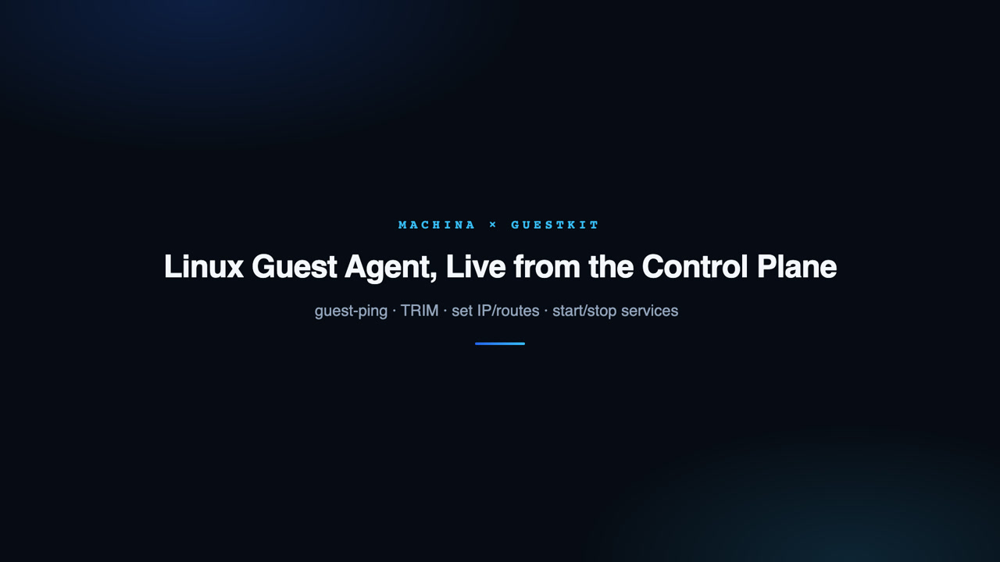

# GuestKit

<p align="center">
  <strong>Offline VM intelligence. Migration assurance you can prove.</strong><br/>
  Score boot readiness <em>before</em> power-on · repair disks offline · certify cutover with a Passport
</p>

<p align="center">
  <a href="https://github.com/hypersdk/guestkit/actions/workflows/ci.yml"></a>
  <a href="https://crates.io/crates/guestkit"></a>
  <a href="https://pypi.org/project/hypersdk-guestkit/"></a>
  <a href="LICENSE"></a>
  <a href="https://github.com/orgs/hypersdk/packages"></a>
</p>

<p align="center">
  <a href="https://zyvor.dev/guestkit?utm_source=github&utm_medium=guestkit"><b>Product</b></a> ·
  <a href="#see-it-in-action"><b>Demos</b></a> ·
  <a href="#quick-start"><b>Quick start</b></a> ·
  <a href="https://github.com/hypersdk/guestkit/wiki"><b>Wiki</b></a> ·
  <a href="docs/ce-vs-enterprise.md"><b>Open source vs Enterprise</b></a> ·
  <a href="docs/enterprise-trial-install.md"><b>30-day Enterprise trial</b></a> ·
  <a href="https://zyvor.dev/contact?utm_source=github&utm_medium=guestkit&intent=demo"><b>Book a demo</b></a>
</p>

---

## The cutover problem — solved offline

Every hypervisor exit fails the same way: you discover the disk was broken **at 2am**, in the cutover window, after power-on.

GuestKit reads the disk **while the guest is off**, scores first-boot probability 0–100, and emits a reviewable fix plan — no libguestfs appliance, no “just try it and hope.”

```text
  disk.qcow2 / .vmdk / .vhdx / .vhd / .vdi / .raw
                    │
                    ▼
         ┌──────────────────────┐
         │  Pure-Rust engine    │──►  doctor 0–100 + blockers
         │  NBD / loop mount    │──►  migrate-plan YAML
         └──────────────────────┘──►  Passport · repair · CI gate
                    │
      CLI · TUI · Python · Web · Agent · GitHub Action
```

| | |
|---|---|
| **70+** commands | **6** disk formats |
| **0** libguestfs appliances | **8** migration targets |
| **Apache-2.0** | Used in CI, labs, and hypervisor-exit programs |

**Certify with GuestKit → convert with [hyper2kvm](https://github.com/hypersdk/hyper2kvm) → operate on [Zeus OS](https://zyvor.dev/zeus-os).**

---

## See it in action

<table>
<tr>
<td width="50%" align="center">
<a href="https://www.youtube.com/watch?v=lLEBQoFceIs">

<br><b>▶ CLI &amp; TUI</b>
</a>
<br><sub>Offline VM intelligence, explained</sub>
</td>
<td width="50%" align="center">
<a href="https://www.youtube.com/watch?v=usQX2rQIFM8">

<br><b>▶ Web Dashboard — Overview</b>
</a>
<br><sub>Server Image Vault, live KubeVirt cluster</sub>
</td>
</tr>
<tr>
<td width="50%" align="center">
<a href="https://www.youtube.com/watch?v=icTLVko588A">

<br><b>▶ Web Dashboard — Deep Dive</b>
</a>
<br><sub>Sources, live cluster, one-click intelligence</sub>
</td>
<td width="50%" align="center">
<a href="https://www.youtube.com/watch?v=LYoqOye3P3I">

<br><b>▶ Machina × GuestKit</b>
</a>
<br><sub>Live Linux guest agent — health, TRIM, netplan, services</sub>
</td>
</tr>
</table>

Recorded live against real deployments — no staged screenshots.

---

## Why teams switch

| Before GuestKit | With GuestKit |
|-----------------|---------------|
| “Will it boot?” answered at power-on | Offline **doctor** score + root-cause chain |
| guestfish scripts and tribal knowledge | Structured plans, JSON/YAML, CI gates |
| Surprises on cutover weekend | Hypervisor-aware **migrate-plan** + day-0 packs |
| No audit trail MTV / virt-v2v can skip | Signed **Cutover Passport** |
| Fleet drift invisible until outage | `fleet analyze` / `watch`, forensic diff, policy-as-code |
| Migration order guessed by hand | `fleet wave-plan` — dependency-aware waves |
| Deep inspect needs a running guest | Carbon **TUI** + in-guest agent over QGA |

---

## 60-second quick start

```bash
cargo install guestkit          # guestkit + guestctl

guestkit doctor vm.qcow2 --target proxmox --explain
guestkit migrate-plan vm.vmdk --target kvm --export plan.yaml
guestkit passport emit vm.qcow2 --target kvm -o passport.json
guestctl tui vm.qcow2           # Assurance · preview · export
```

**CI gate** — same score, no CLI install step:

```yaml
- uses: hypersdk/guestkit@v1
  with:
    disk: vm.qcow2
    target: kvm
    fail-below: '80'
```

Targets: `kvm` · `proxmox` · `qemu` · `kubevirt` · `aws` · `azure` · `gcp` · `hyperv`

Host needs: Linux with `qemu-img`, `losetup`, and `qemu-nbd` (mount/repair may need root).

| You want… | Go here |
|-----------|---------|
| First hour | [Getting started](docs/user-guides/getting-started.md) |
| Cheat sheet | [Quick reference](docs/user-guides/quick-reference.md) |
| Full feature map | [Customer feature guide](docs/guestkit-customer-feature-guide.md) |
| Open source vs Enterprise | [ce-vs-enterprise.md](docs/ce-vs-enterprise.md) |

---

## What you can do

### Assure · plan · certify

```bash
guestkit doctor vm.qcow2 --target proxmox --explain
guestkit migrate-plan vm.vmdk --target proxmox --export plan.yaml
guestkit passport emit vm.qcow2 --target kvm -o passport.json
guestkit passport verify passport.json --fail-below 80
```

### Repair offline (no boot required)

```bash
guestkit plan generate disk.qcow2 -p linux-ssh --user ubuntu --key-file ~/.ssh/id_ed25519.pub
guestkit rescue disk.qcow2 -o enable-ssh
guestkit rescue disk.qcow2 -o fix-grub --force
guestkit rescue win.qcow2 -o reset-password --user Administrator --password '…'
guestkit plan apply plan.yaml --vm disk.qcow2 --yes     # backups + rollback
```

### Live control · platform · AI

- **In-guest agent** (Linux + Windows) over virtio-serial / QGA — inject offline, then `agent-proxy` / `agent-call`
- **Optional AI** (`--features ai`) — read-only tool-calling over the offline evidence snapshot; MCP server via `--features mcp`
- **KubeVirt** boot-inspect hooks and Guest Control Fabric
- **Web console** + worker on GHCR · Helm under `deploy/helm/zyvor`
- **Python:** `pip install hypersdk-guestkit` → `from guestkit import Guestfs`

---

## Run the free web stack (GHCR)

Public images under **`ghcr.io/hypersdk`** — no `docker login` required.

| Image | Role |
|-------|------|
| `ghcr.io/hypersdk/zyvor-ui` | Web console — Image Vault, KubeVirt cluster |
| `ghcr.io/hypersdk/zyvor-api` | API |
| `ghcr.io/hypersdk/guestkit-worker` | Disk-inspection worker |

```bash
docker compose -f deploy/docker-compose.ghcr.yml pull
docker compose -f deploy/docker-compose.ghcr.yml up -d
open http://localhost:8088
```

> **Eval only** — unauthenticated stack. Do not expose beyond localhost.  
> Production: `deploy/docker-compose.prod.example.yml` · [Docker guide](docs/guides/DOCKER.md) · [Helm](deploy/helm/zyvor)

---

## Open source vs Enterprise

<table>
<tr>
<td width="50%" valign="top">

### Open source — free forever
**This repo** · Apache-2.0

- Full offline **doctor**, migrate-plan, repair, fleet, policy  
- CLI · TUI · Python · self-hosted web/workers  
- GitHub Action Passport gate  
- Free `zyvor-ui` Image Vault dock  
- Best for labs, CI, and small fleets  

</td>
<td width="50%" valign="top">

### Enterprise — buy for programs
**[zyvor.dev/guestkit](https://zyvor.dev/guestkit?utm_source=github&utm_medium=guestkit)**

- Same engine — **not** a locked doctor  
- **Command Center** · Portfolio · Assurance  
- **Image Vault** (inspect/doctor/repair/migrate-plan, sources, batch, launch YAML, agent)  
- **Migration Factory** · **Passport Authority** (+ JSON download)  
- Dependencies · Policies · Compliance · **Reports** (JSON/CSV)  
- **Sites & Workers** · **KubeVirt** · Integrations · **Copilot** · Admin  
- OIDC / RBAC / audit · mobile console · command palette  
- SLA · air-gap · **hypervisor exit** workshops  
- Pipeline: HyperSDK → hyper2kvm → GuestKit → **Zeus OS** → PacketWolf  

</td>
</tr>
</table>

> **One failed first-boot weekend costs more than the license.**  
> Enterprise turns offline scores into shared, gated decisions your board can fund.

### 30-day Enterprise trial (binary)

Try the control plane before you buy — same packaging pattern as Veyron:

1. Download the **trial** asset from [GitHub Releases](https://github.com/hypersdk/guestkit/releases?q=enterprise-trial) (`guestkit-enterprise-*-trial-linux-amd64.tar.gz`)
2. Verify the `.sha256`, extract, run `./install.sh`
3. Keep bundled `trial.token` next to the install — after 30 days email **sales@zyvor.dev**

**[Full install instructions →](docs/enterprise-trial-install.md)**

**[Full feature matrix (every screen) →](docs/ce-vs-enterprise.md)** · **[What Zyvor sells →](docs/zyvor-enterprise.md)** · **[Book a demo](https://zyvor.dev/contact?utm_source=github&utm_medium=guestkit&intent=demo)** · **[Pricing](https://zyvor.dev/pricing?utm_source=github&utm_medium=guestkit)** · [sales@zyvor.dev](mailto:sales@zyvor.dev)

---

## Platform layout

```text
┌────────────────────────────────────────────────────────────┐
│  guestkit CLI · guestctl TUI · Python · Web · Agent        │
├────────────────────────────────────────────────────────────┤
│  Rust evidence engine · boot scoring · fix-plan apply      │
├────────────────────────────────────────────────────────────┤
│  JSON · YAML · HTML · PDF · Passport · CI exit codes       │
└────────────────────────────────────────────────────────────┘
```

| Layer | In this repo |
|-------|----------------|
| **Engine** | Pure-Rust parsers + evidence schema · NBD/loop (`src/`, `crates/`) |
| **CLI / TUI** | `guestkit` · `guestctl` — doctor, passport, fleet, rescue |
| **Agent** | Linux + Windows · protocol 1.3 · `agent-inject` / `agent-proxy` |
| **Python** | [hypersdk-guestkit](https://pypi.org/project/hypersdk-guestkit/) |
| **K8s** | KubeVirt hooks · `k8s/` |
| **Web / worker** | GHCR images · `deploy/` |

---

## Documentation

| Goal | Document |
|------|----------|
| Operator wiki | [hypersdk/guestkit/wiki](https://github.com/hypersdk/guestkit/wiki) |
| Docs home | [docs/README.md](docs/README.md) · [INDEX](docs/INDEX.md) |
| **DevOps runbooks** | [docs/devops](docs/devops/README.md) |
| Feature guide | [guestkit-customer-feature-guide.md](docs/guestkit-customer-feature-guide.md) |
| Docker / GHCR | [DOCKER.md](docs/guides/DOCKER.md#published-images-ghcr) |
| Remote deploy | [DEPLOY-REMOTE.md](docs/guides/DEPLOY-REMOTE.md) |
| Architecture | [overview](docs/architecture/overview.md) |
| Changelog / roadmap | [CHANGELOG](docs/development/CHANGELOG.md) · [roadmap](docs/development/roadmap.md) |

→ [zyvor.dev/guestkit](https://zyvor.dev/guestkit) · [docs](https://zyvor.dev/docs?utm_source=github&utm_medium=guestkit) · [blog](https://zyvor.dev/blog?utm_source=github&utm_medium=guestkit)

---

## Development

```bash
cargo build --release
cargo test
```

See [CONTRIBUTING](docs/development/CONTRIBUTING.md) and CI under `.github/workflows/`. **`docs/` and this README are authoritative.**

---

## License

[Apache-2.0](LICENSE) · additional notes in `docs/legal/` where applicable.
