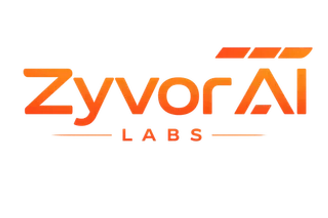

# Enterprise & HyperSDK Platform

  

This repository ships the open-source **GuestKit** toolkit — the offline disk engine buyers evaluate first.  
**GuestKit Enterprise** is the commercial **migration control plane** that runs the program on top of this engine. For production migrations, SLAs, and the full platform, contact **[Zyvor AI Labs](https://zyvor.dev/)**.

## Contact Zyvor

| | |
|---|---|
| **Platform** | **[zyvor.dev](https://zyvor.dev/)** |
| **▶ Product & pricing** | **[zyvor.dev/guestkit](https://zyvor.dev/guestkit?utm_source=github&utm_medium=guestkit)** · **[pricing](https://zyvor.dev/pricing?utm_source=github&utm_medium=guestkit)** |
| **▶ Migration demo** | **[zyvor.dev/demo](https://zyvor.dev/demo?utm_source=github&utm_medium=guestkit)** — video + live dashboard |
| **Sales & guided demos** | [sales@zyvor.dev](mailto:sales@zyvor.dev) · [contact form](https://zyvor.dev/contact?intent=demo) |
| **General inquiries** | [info@zyvor.dev](mailto:info@zyvor.dev) |

## Why buy GuestKit Enterprise (not only OSS)

| Buyer need | Open source GuestKit | GuestKit Enterprise |
| --- | --- | --- |
| Prove a disk will boot offline | ✅ `doctor` | ✅ same scores in Command Center / Image Vault |
| Gate CI with Passports | ✅ Action + CLI | ✅ same evidence + in-product Passport Authority |
| Run a multi-wave hypervisor exit | Scripts / Excel | ✅ Migration Factory + portfolio |
| SSO / RBAC / audit for change boards | DIY | ✅ Keycloak reference + audit stream |
| One console for execs and operators | Free `zyvor-ui` (lab) | ✅ Command Center + free-dock parity |
| Vendor SLA on cutover programs | Community Issues | ✅ Zyvor SLA, workshops, air-gap packs |

**Enterprise does not replace this repo** — it productizes program ops while calling `guestkit doctor` underneath. Full compare: [ce-vs-enterprise.md](ce-vs-enterprise.md).

## HyperSDK Platform product suite

One pipeline from export to operations — **one API, one operating model**:

| Product | Role |
|---------|------|
| [GuestKit](https://zyvor.dev/guestkit) | Offline guest disk inspect, repair, Cutover Passport (CI gate before convert) |
| [GuestKit Enterprise](https://zyvor.dev/guestkit#enterprise) | Migration control plane: Command Center, waves, Passport Authority, OIDC |
| [hyper2kvm](https://zyvor.dev/hyper2kvm) | Conversion, VirtIO/boot fixes, validation — consumes Passport-ready images |
| [HyperSDK Platform](https://zyvor.dev/hypersdk) | Multi-cloud VM export (10+ providers), APIs, scheduling |
| [Zeus OS](https://zyvor.dev/zeus-os) | Visual infrastructure OS — KubeVirt fleet & day-2 ops |
| [PacketWolf](https://zyvor.dev/packetwolf) | eBPF network observability |
| [VMRogue](https://zyvor.dev/vmrogue) | Image & disk build pipeline |
| [Aether](https://zyvor.dev/aether) | Deploy & workload runtime |
| [Machina](https://zyvor.dev/machina) | KVM / libvirt host control |
| [Forge](https://zyvor.dev/forge) · [IronWolf](https://zyvor.dev/ironwolf) | GPU fabric & bare-metal lifecycle |
| [HyperCluster](https://zyvor.dev/hypercluster) · [Ragnarok](https://zyvor.dev/ragnarok) | Clustering & coordination |

→ [Full product comparison](https://zyvor.dev/docs/products) · [Suite guides](https://zyvor.dev/docs/intro#suite-product-guides)

## Enterprise features (via Zyvor)

- **GuestKit Enterprise control plane** — Command Center, multi-site portfolio, Image Vault (free UX parity), Migration Factory, Passport Authority, reports export, KubeVirt inventory, OIDC/RBAC/audit  
- hypervisor exit & multi-cloud migration programs  
- Air-gapped / disconnected deployments  
- SOC2-ready controls, RBAC/SSO, audit logging  
- SLA options, professional services, partner/MSP programs  
- Carbon-aware scheduling and fleet-scale automation  

## When to approach zyvor.dev

Contact **sales@zyvor.dev** or [zyvor.dev/contact](https://zyvor.dev/contact?intent=sales) when you need:

- GuestKit Enterprise license or support contracts (not GitHub Issues)  
- 50+ VM migrations or regulated-environment rollouts  
- Integrated platform features (dashboard, multi-tenant ops, full provider matrix)  
- Demos, architecture reviews, or migration planning workshops  

**Start here:** [zyvor.dev/guestkit](https://zyvor.dev/guestkit) · compare editions: [ce-vs-enterprise.md](ce-vs-enterprise.md)

Community bugs and contributions stay on [GitHub Issues](https://github.com/hypersdk/guestkit/issues).
